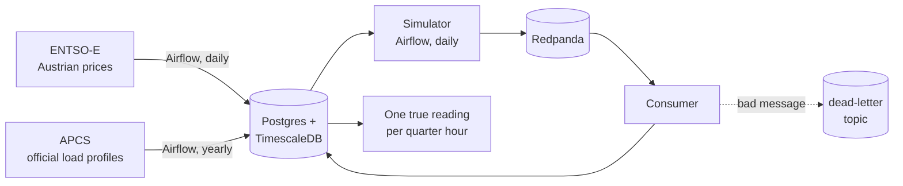

# MegaVolt

An Austrian electricity supplier that does not exist, run as carefully as one that does.

Our customers belong to an energy community that shares its own solar power. Every 15 minutes the
community takes what it needs, and we sell the rest. So we do not sell consumption, we sell
whatever is *left of it*. Sunny afternoon? Our volume vanishes, and nobody used less.

We still had to buy that volume yesterday. Every quarter hour we guessed wrong, the grid operator
sends us a bill.

## Where this is going

An internal pricing tool. Sales picks a customer and gets, in seconds, a fixed price and a dynamic
one that tracks the market — with the reasons — instead of waiting an afternoon for an analyst.

## What runs today



- **Real prices.** Austrian day-ahead prices from [ENTSO-E](https://transparency.entsoe.eu/), fetched every afternoon.
- **Real shapes, invented people.** The load profiles Austria uses to settle small customers shape a 600-member community. 350 of them are ours.
- **Messy on purpose.** Readings arrive the way grid operators send them: a day late, sometimes three; some wrong and corrected a week later; some with a meter swapped. Same seed, same bytes, every run.
- **Crash-safe.** The consumer commits to the database first and to Kafka second, so a crash replays a batch instead of losing a day. A bad message goes to a dead-letter topic, never into the data.
- **One truth.** A staging query picks the value that counts: the correction beats the first delivery.

March 2025, backfilled through Airflow: **1,072,087 readings**, 2,631 corrections, one 92-quarter-hour day when the clocks changed, zero dead letters.

## Built like it's real

- The pipeline's database role can read and insert, nothing else. Raw data is append-only because the database refuses the rest.
- Every commit is scanned for secrets, locally and in CI. Docker images and GitHub Actions are pinned.
- Nothing listens beyond localhost.
- 186 tests on every commit, plus 10 against a real database.

## Next

- [x] Prices, load profiles and the meter stream
- [ ] dbt models with data-quality tests
- [ ] Community allocation and settlement
- [ ] Pricing engine
- [ ] The pricing tool

## Run it

```sh
cp .env.example .env      # fill in the blanks
docker compose up -d      # warehouse, Redpanda, consumer, Airflow on localhost:8080
uv run pytest
```

Python 3.13 · Airflow 3 · Redpanda · Postgres + TimescaleDB · Docker Compose · GitHub Actions

— Mark Cvelfer Domadenik
